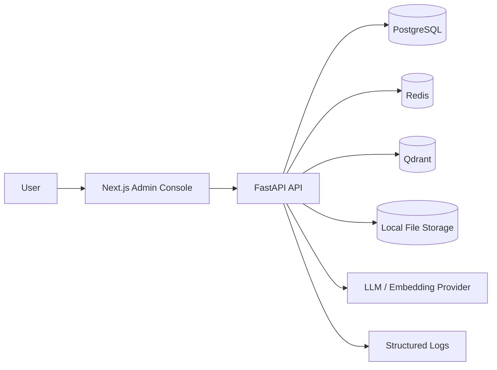

# Architecture

## Context

Enterprise AI Copilot Lab is a learning platform for enterprise LLM application engineering. The first release builds a minimal but complete knowledge-base RAG loop.



## Runtime Units

- Frontend: browser-facing admin console.
- API: modular FastAPI app exposing auth, knowledge base, document, RAG, prompt, and log APIs.
- Worker: planned background process for document parsing and indexing; M1 only reserves boundaries.
- PostgreSQL: source of truth for users, metadata, prompts, chats, logs, and evaluation data.
- Redis: cache and future task queue backend.
- Qdrant: vector store for document chunks.
- Local file storage: MVP storage for uploaded raw files.

## Backend Module Boundaries

```text
Interface / API router
  -> Application use case
  -> Domain model and rules
  -> Infrastructure adapter
```

MVP modules:

- `auth`: login, JWT, current user.
- `knowledge_bases`: knowledge base ownership and lifecycle.
- `documents`: upload, parsing status, chunk metadata.
- `rag`: retrieval, generation, answer logging, feedback.
- `prompts`: prompt templates and versions.
- `logs`: system and operation logs.

## Frontend Page Boundaries

MVP pages:

- `/login`
- `/dashboard`
- `/knowledge-bases`
- `/documents`
- `/rag`
- `/prompts`
- `/logs`

Pages assemble feature components and API clients. They do not encode backend business rules.

## Data Strategy

PostgreSQL keeps metadata and auditable records. Qdrant stores vectors. Raw uploads stay on local disk for MVP and are abstracted so MinIO/S3 can replace it later.

## Non-Goals For MVP

- Multi-tenant SaaS billing.
- Kubernetes production high availability.
- Complex Agent orchestration.
- MCP integration.
- LoRA training.
- Browser extension, mini program, or mobile app.
