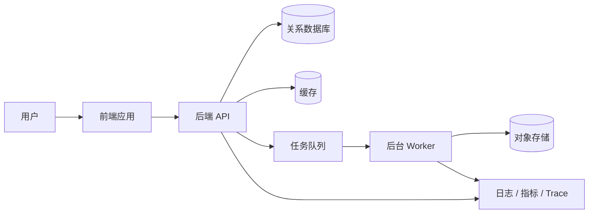

# Vibe Coding 工程化开发完整指南

> 版本：1.0  
> 更新日期：2026-06-06  
> 适用对象：使用 Codex、Claude Code、GitHub Copilot、Gemini Code Assist、Cursor、Trae 等 AI Agent 开发项目的个人与团队  
> 核心目标：保留 AI 编程的速度，同时获得传统优秀工程团队的可维护性、可测试性、安全性和协作能力

---

## 目录

1. [先建立正确认识](#1-先建立正确认识)
2. [大厂公开实践的共同结论](#2-大厂公开实践的共同结论)
3. [一套正确的 Vibe Coding 总流程](#3-一套正确的-vibe-coding-总流程)
4. [需求与项目启动](#4-需求与项目启动)
5. [架构如何正确设计](#5-架构如何正确设计)
6. [前端开发流程](#6-前端开发流程)
7. [后端开发流程](#7-后端开发流程)
8. [数据库开发流程](#8-数据库开发流程)
9. [测试与质量保障](#9-测试与质量保障)
10. [安全、运维与发布](#10-安全运维与发布)
11. [如何高效地与 AI Agent 沟通](#11-如何高效地与-ai-agent-沟通)
12. [如何节省 Token](#12-如何节省-token)
13. [AGENTS.md、Skill、MCP 应该怎么用](#13-agentsmdskillmcp-应该怎么用)
14. [Git 与 GitHub 正确工作流](#14-git-与-github-正确工作流)
15. [多人和多 Agent 协作](#15-多人和多-agent-协作)
16. [常见失败模式](#16-常见失败模式)
17. [可直接复制的模板](#17-可直接复制的模板)
18. [个人成长路线](#18-个人成长路线)
19. [每日开发检查表](#19-每日开发检查表)
20. [参考资料](#20-参考资料)

---

## 1. 先建立正确认识

### 1.1 什么是好的 Vibe Coding

好的 Vibe Coding 不是：

- 不读代码，只让 AI 一直改到“看起来能运行”。
- 一次把整个项目交给 Agent，然后直接上线。
- 用自然语言替代需求分析、架构设计、测试和代码审查。
- 遇到错误就不断追加提示，直到上下文充满失败方案。
- 把 AI 生成的代码视为天然正确。

好的 Vibe Coding 是：

> 人负责目标、约束、架构、风险和验收；AI 负责检索、实现、重复劳动、验证和反馈；所有结果通过代码、测试、文档、Git 和 CI 留下可审计证据。

你仍然是工程负责人。Agent 是速度很快、知识很广、但可能误解需求和生成错误代码的协作者。

### 1.2 开发者的新核心能力

AI 时代不代表“不需要懂代码”，而是能力重心发生变化：

| 过去偏重 | 现在更重要 |
|---|---|
| 记住大量语法 | 定义准确的问题和边界 |
| 手写所有样板代码 | 审核 AI 的实现与取舍 |
| 单文件编码速度 | 系统设计、接口和数据建模 |
| 靠人工发现错误 | 建立自动验证闭环 |
| 口头传递上下文 | 把知识写进仓库 |
| 一个人改完整项目 | 划分可并行、低冲突的工作单元 |

### 1.3 最重要的原则

1. **先理解，后修改。**
2. **先定义验收标准，后让 AI 实现。**
3. **一次只解决一个边界清晰的问题。**
4. **让 Agent 能自行验证结果。**
5. **小步提交，小 PR 合并。**
6. **重要知识进入仓库，不只留在聊天记录。**
7. **高风险操作必须由人确认。**
8. **AI 产出必须经过测试和人类审查。**

---

## 2. 大厂公开实践的共同结论

本章不是声称所有公司内部都使用同一套流程，而是归纳 OpenAI、Anthropic、GitHub、Google、AWS、Microsoft 和 OWASP 公开资料中的共同工程方法。

### 2.1 OpenAI：给 Agent 一张地图，而不是一本巨型说明书

OpenAI 公开的 Agent-first 工程实践强调：

- 将大目标拆为设计、编码、审查、测试等小模块，逐层完成。
- 仓库是知识的事实来源。
- 短小的 `AGENTS.md` 作为目录和导航，详细内容放入结构化 `docs/`。
- 让系统尽可能可被 Agent 检查、运行、验证和修改。
- 多 Agent 通过隔离工作区并行工作。

这意味着不要写一个几千行、什么都包含的 Agent 指令文件。正确方式是：

```text
AGENTS.md                # 入口、关键命令、禁止事项、文档索引
ARCHITECTURE.md          # 系统边界和依赖方向
docs/
├── product/             # 产品需求与业务规则
├── architecture/        # 架构、ADR、接口约束
├── plans/               # 正在执行和已完成的计划
├── runbooks/            # 部署、回滚、故障处理
└── generated/           # 自动生成的 Schema/API 文档
```

### 2.2 Anthropic：上下文是稀缺资源，验证是最高杠杆

Anthropic 的公开建议包括：

- Agent 的上下文会被对话、文件和命令输出快速填满。
- 不相关任务应使用新会话或清理上下文。
- 为 Agent 提供测试、截图或预期输出，使其能验证自己的工作。
- 调研可交给独立子 Agent，主上下文只保留结论。
- 同一问题连续纠正多次后，应停止堆叠旧错误，重新整理需求再开始。
- `CLAUDE.md` 等说明文件应简短，重复性强制规则更适合做成 Hook 或 CI。

可总结为：

> Agent 的效果主要取决于上下文质量和反馈闭环，而不是上下文数量。

### 2.3 GitHub：清晰 Issue、小任务、PR 审查和仓库规则

GitHub 对 Coding Agent 和 GitHub Flow 的建议包括：

- 任务应有明确问题描述、验收标准和文件范围。
- 一个分支只处理一组相关修改。
- 每个提交应是独立、完整、可回退的变化。
- 通过 PR 获取反馈，不直接向 `main` 推送。
- 使用分支保护、必需检查、CODEOWNERS 和 PR 模板。
- 对复杂、含敏感数据、生产关键、身份认证或高度模糊的任务保持人工主导。
- Agent 生成的 PR 必须由人类审查。

### 2.4 Google：覆盖完整软件生命周期，但必须验证输出

Google 将 AI 编程助手定位于构建、部署和运行等完整软件生命周期，同时明确提醒 AI 可能生成不正确内容，开发者必须验证输出。

### 2.5 AWS、Microsoft、OWASP：生产系统不能只关心“代码能跑”

公开的云架构和安全实践反复强调：

- 自动化测试、部署和回滚。
- 基础设施即代码。
- 可观测性、可靠性、性能、成本和安全共同构成架构质量。
- 凭据进入 Secrets Manager 或同类安全系统，不能提交到源码。
- 威胁建模应尽早、持续、轻量地进行。

### 2.6 共同结论

大厂公开实践可以压缩为一个循环：

```text
理解上下文
  ↓
定义问题与验收标准
  ↓
设计最小可行变更
  ↓
在隔离分支/工作区实现
  ↓
运行自动验证
  ↓
审查差异和风险
  ↓
PR、CI、合并、部署
  ↓
观察指标并形成文档
```

---

## 3. 一套正确的 Vibe Coding 总流程

### 3.1 项目从 0 到上线的阶段

| 阶段 | 人的主要责任 | AI Agent 的主要责任 | 必须产出 |
|---|---|---|---|
| 发现 | 判断用户和业务问题 | 调研、整理竞品、发现疑问 | 问题陈述 |
| 需求 | 决定范围和优先级 | 整理 PRD、用例、边界 | PRD、验收标准 |
| 架构 | 决定边界和关键取舍 | 分析方案、风险和依赖 | 架构图、ADR |
| 计划 | 划分任务和所有权 | 生成可执行任务清单 | Issue/执行计划 |
| 实现 | 审核关键逻辑 | 编码、重构、补测试 | 小步代码变更 |
| 验证 | 决定是否达到预期 | 运行测试、静态检查、截图 | 验证证据 |
| 评审 | 对正确性负责 | 自审、解释差异和风险 | PR |
| 发布 | 批准上线和回滚方案 | 构建、部署、生成说明 | 可追踪制品 |
| 运行 | 决定故障处置 | 汇总日志、指标、告警 | 监控和 Runbook |
| 复盘 | 修正流程和架构 | 整理根因与行动项 | ADR/文档/测试 |

### 3.2 每个功能都遵循“小闭环”

每一个功能、Bug 或重构都执行：

```text
Task Brief
→ Agent 调研
→ 实施计划
→ 小范围修改
→ 格式化
→ 静态检查
→ 单元测试
→ 集成/E2E 测试
→ 人工审查 diff
→ 提交
→ PR
→ CI
→ 合并
```

### 3.3 Definition of Ready：什么任务才可以开始

任务开始前至少满足：

- [ ] 问题和目标清楚。
- [ ] 非目标已经说明。
- [ ] 验收标准可验证。
- [ ] 已知受影响模块。
- [ ] API、数据结构或 UI 变化已经明确。
- [ ] 高风险点已标记。
- [ ] 测试方式已说明。
- [ ] 任务规模可在一个小 PR 内完成。

### 3.4 Definition of Done：什么任务才算完成

- [ ] 实现满足验收标准。
- [ ] 没有修改任务范围外的代码。
- [ ] 新行为有测试。
- [ ] 原有测试通过。
- [ ] lint、类型检查、构建通过。
- [ ] 数据库迁移支持前向部署，必要时有恢复方案。
- [ ] 日志不包含密码、Token 和个人敏感信息。
- [ ] 文档、示例配置和变更记录已更新。
- [ ] PR 说明包含风险、验证证据和回滚方法。
- [ ] 至少一位非作者完成审查，关键功能不能只由 AI 自审。

---

## 4. 需求与项目启动

### 4.1 先问清楚“为什么”，再决定“怎么写”

项目启动时回答：

1. 用户是谁？
2. 用户现在遇到什么问题？
3. 成功的可测量标准是什么？
4. 第一版必须有什么？
5. 第一版明确不做什么？
6. 数据来自哪里，归谁所有？
7. 有哪些安全、隐私、法规要求？
8. 预期用户量、请求量、数据量是多少？
9. 上线方式和预算是什么？
10. 失败后如何降级、恢复和回滚？

### 4.2 PRD 至少包含

```text
背景
目标
非目标
用户故事
业务规则
主流程
异常流程
权限矩阵
数据要求
性能要求
兼容性要求
验收标准
上线指标
待确认问题
```

### 4.3 验收标准必须可执行

不好的描述：

> 做一个好看的登录页，登录要稳定。

好的描述：

```text
Given 用户位于登录页
When 输入有效账号密码并提交
Then 2 秒内跳转到控制台
And 刷新页面后登录状态仍有效

Given 密码错误
When 连续提交 5 次
Then 返回统一错误提示
And 账号或来源进入限流
And 日志不得记录明文密码
```

### 4.4 先做垂直切片，不要横向铺满

错误方式：

```text
先生成全部页面
→ 再生成全部 API
→ 再统一连接数据库
→ 最后才测试
```

推荐方式：

```text
一个最小用户故事
→ 一个页面
→ 一个 API
→ 一条数据库路径
→ 一组测试
→ 可部署
```

垂直切片能更早发现架构、接口、权限和部署问题。

---

## 5. 架构如何正确设计

### 5.1 默认选择简单架构

新项目不要因为 AI 能快速生成代码，就默认使用微服务、事件总线、CQRS、Kubernetes 和多数据库。

通常优先级是：

1. 模块化单体。
2. 清晰模块边界。
3. 单一主数据库。
4. 稳定 API 契约。
5. 自动测试与部署。
6. 当真实的规模、团队或隔离需求出现后，再拆服务。

微服务解决的是组织和规模问题，也会引入网络失败、分布式事务、追踪、版本兼容、部署协调和更高运维成本。

### 5.2 先画四张图

1. **系统上下文图**：用户、系统、外部服务。
2. **容器/运行单元图**：Web、API、Worker、数据库、缓存、对象存储。
3. **模块图**：模块职责和依赖方向。
4. **部署图**：开发、测试、预发布、生产环境。

示例：



### 5.3 明确依赖方向

推荐的后端逻辑分层：

```text
Interface / Controller
        ↓
Application / Use Case
        ↓
Domain
        ↓
Infrastructure Adapter
```

关键原则：

- 业务规则不依赖 Web 框架。
- Controller 不直接堆积业务逻辑。
- 数据库模型不等于 API 响应模型。
- 外部服务通过 Adapter 隔离。
- 跨模块调用经过公开接口，不导入对方内部文件。

### 5.4 按业务能力组织，而不是按文件类型堆放

规模增大后，推荐：

```text
src/
├── users/
│   ├── api/
│   ├── application/
│   ├── domain/
│   ├── infrastructure/
│   └── tests/
├── orders/
├── billing/
└── shared/
```

谨慎使用巨型目录：

```text
controllers/
services/
models/
utils/
```

后者容易让任何功能都横跨全仓库，增加 Agent 和多人协作冲突。

### 5.5 API 契约先行

前后端并行前先确定：

- 路径和 HTTP 方法。
- 请求参数和类型。
- 响应结构。
- 统一错误结构。
- 分页方式。
- 鉴权方式。
- 幂等性要求。
- 版本兼容策略。

推荐使用 OpenAPI、JSON Schema、Protocol Buffers 等机器可读契约，并自动生成客户端或类型。

### 5.6 用 ADR 记录关键决策

以下情况应写 Architecture Decision Record：

- 选择数据库、队列、框架。
- 改变鉴权模型。
- 引入微服务。
- 改变 API 兼容策略。
- 改变部署和回滚方案。
- 接受一个明显的技术折衷。

ADR 不需要长，但必须记录“为什么”，避免未来的 Agent 根据局部代码推翻历史约束。

### 5.7 架构审查问题

- 模块职责能否用一句话说明？
- 是否存在循环依赖？
- 失败会影响多大范围？
- 外部服务失败时怎么办？
- 数据一致性要求是什么？
- 哪些操作需要幂等？
- 哪些流程需要事务？
- 是否可观测？
- 是否能本地运行和自动测试？
- 是否有不必要的技术复杂度？

---

## 6. 前端开发流程

### 6.1 前端开始前

- 确认页面目标、用户流程和状态。
- 确认 API 契约。
- 列出 loading、empty、error、success、disabled、permission denied 等状态。
- 确认响应式、浏览器和无障碍要求。
- 先识别现有设计系统和组件，不重复造轮子。

### 6.2 推荐实现顺序

1. 路由和页面边界。
2. 静态布局。
3. 组件状态。
4. API 类型和客户端。
5. 数据请求与缓存。
6. 表单校验。
7. 错误和空状态。
8. 权限控制。
9. 单元/组件测试。
10. E2E 主路径。
11. 截图或视觉回归。
12. 性能和无障碍检查。

### 6.3 前端边界

- 页面组件负责组合，不承担所有业务逻辑。
- 通用组件不能偷偷包含具体业务规则。
- 服务端状态和本地 UI 状态分开。
- 不在多个页面复制 API 调用和错误处理。
- 不直接依赖后端数据库字段。
- 对用户输入做前端校验，但后端仍必须重新校验。

### 6.4 让 Agent 验证前端

提示中明确要求：

```text
完成后：
1. 运行 lint、类型检查和前端测试；
2. 启动本地应用；
3. 在浏览器走通主流程和错误流程；
4. 检查控制台错误；
5. 提供修改前后截图；
6. 说明未覆盖的浏览器和交互。
```

“页面能编译”不等于“页面正确”。

### 6.5 前端 PR 检查

- [ ] 所有状态是否完整？
- [ ] 是否存在重复组件？
- [ ] 是否破坏响应式布局？
- [ ] 键盘能否操作？
- [ ] 错误提示是否对用户有用？
- [ ] 是否泄漏服务端错误和敏感信息？
- [ ] 是否产生不必要重渲染或巨型 Bundle？
- [ ] API 类型是否来自契约？

---

## 7. 后端开发流程

### 7.1 后端开始前

- 明确用例和业务不变量。
- 明确认证与授权。
- 明确请求/响应 Schema。
- 明确事务范围。
- 明确重试、超时和幂等策略。
- 明确日志、指标和审计要求。

### 7.2 推荐实现顺序

1. 写用例和验收测试。
2. 定义请求/响应 Schema。
3. 定义领域规则或应用服务。
4. 定义 Repository/外部服务接口。
5. 实现基础设施 Adapter。
6. 实现 Controller。
7. 加入鉴权、校验、错误映射。
8. 添加日志、指标和 Trace。
9. 运行单元、集成和契约测试。

### 7.3 API 必须关注

- 输入校验和大小限制。
- 认证与对象级授权。
- 超时与取消。
- 幂等键。
- 统一错误码。
- 分页与排序限制。
- 并发更新和乐观锁。
- 限流和防滥用。
- 日志脱敏。
- API 兼容性。

### 7.4 外部服务调用

Agent 很容易只写“成功路径”。必须要求：

- 设置连接和读取超时。
- 仅对可安全重试的错误重试。
- 使用指数退避和抖动。
- 避免无限重试。
- 写入操作考虑幂等。
- 记录外部依赖延迟和失败率。
- 必要时使用熔断、队列或降级。

### 7.5 后端 PR 检查

- [ ] 业务规则是否散落在 Controller？
- [ ] 授权是否只检查“已登录”，没有检查资源归属？
- [ ] 是否误吞异常？
- [ ] 是否返回内部堆栈？
- [ ] 是否出现 N+1 查询？
- [ ] 是否缺少事务或幂等？
- [ ] 是否把密钥写进代码或日志？
- [ ] 是否修改了公共契约但没有版本策略？

---

## 8. 数据库开发流程

### 8.1 数据库先建模，再生成代码

先定义：

- 实体和生命周期。
- 主键策略。
- 唯一约束。
- 外键与删除行为。
- 可空性。
- 索引和主要查询。
- 时间、时区和金额类型。
- 多租户隔离方式。
- 审计和软删除要求。
- 数据保留与清理策略。

### 8.2 Schema 变更必须使用迁移

禁止：

- 人工登录生产库随手改表。
- 修改旧迁移伪造历史。
- 只更新 ORM，不生成迁移。
- 部署应用后才发现数据库不兼容。

推荐：

```text
修改模型
→ 生成迁移
→ 人工审查 SQL
→ 在空库执行
→ 在接近生产规模的数据上测试
→ 验证升级路径
→ 设计恢复或前滚方案
→ 随应用版本发布
```

### 8.3 使用 Expand/Contract 避免停机

危险做法：

```text
直接重命名或删除生产字段
```

推荐：

1. Expand：新增兼容字段/表。
2. 应用同时兼容新旧结构。
3. 回填历史数据。
4. 切换读取和写入。
5. 观察稳定性。
6. Contract：后续版本再删除旧结构。

数据库迁移通常不应依赖“回滚一切”。大数据迁移更适合可恢复、可继续执行的前滚方案。

### 8.4 数据库测试

- 迁移在空库可执行。
- 从当前生产版本可升级。
- 重复运行不会造成破坏，或工具能正确识别已执行状态。
- 关键查询使用真实数据库做集成测试。
- 检查执行计划和索引。
- 回填脚本支持断点、批处理和限速。
- 备份恢复流程经过演练。

### 8.5 AI 使用数据库时的权限

- 默认只给开发库。
- 生产库优先只读。
- 写操作必须人工批准。
- 不把生产数据直接粘贴进公共模型。
- 对敏感数据脱敏。
- MCP 数据库工具使用最小权限账号。
- DDL、批量更新、删除必须显示 SQL 和影响行数预估。

---

## 9. 测试与质量保障

### 9.1 测试不是最后一步

测试承担三种作用：

1. 说明预期行为。
2. 给 Agent 提供自动反馈。
3. 防止后续 Agent 修改旧功能。

### 9.2 推荐测试层次

| 类型 | 测什么 | 特点 |
|---|---|---|
| 静态检查 | 格式、lint、类型、依赖 | 快，最先运行 |
| 单元测试 | 业务规则、纯函数 | 数量最多、定位快 |
| 集成测试 | 数据库、队列、外部 Adapter | 验证真实边界 |
| 契约测试 | 前后端或服务接口 | 防止接口漂移 |
| E2E | 关键用户旅程 | 数量少但价值高 |
| 性能测试 | 延迟、吞吐、资源 | 发布前或定期 |
| 安全测试 | 依赖、SAST、Secret、DAST | CI 和周期执行 |

### 9.3 Bug 修复标准流程

```text
复现问题
→ 写一个会失败的回归测试
→ 确认测试因正确原因失败
→ 做最小修复
→ 确认新测试通过
→ 运行相关测试集
→ 审查是否存在同类问题
```

不要只把异常“压下去”。要求 Agent 解释根因、触发条件和为什么修复有效。

### 9.4 测试 Agent 产出的代码

至少检查：

- 测试是否真的执行了目标代码。
- 断言是否有意义，而不是只断言“没有报错”。
- Mock 是否过多，以至于测试的是 Mock 本身。
- 是否覆盖边界值、空值、并发和失败路径。
- 测试是否稳定，是否依赖真实时间和外网。
- Agent 是否为了让测试通过而删除断言、跳过测试或降低阈值。

### 9.5 CI 最小门禁

```text
格式检查
lint
类型检查
单元测试
集成测试
构建
依赖漏洞扫描
Secret 扫描
数据库迁移检查
```

关键项目再加入：

```text
E2E
性能基线
SAST/DAST
制品签名
SBOM
部署到临时环境
人工批准生产部署
```

---

## 10. 安全、运维与发布

### 10.1 安全左移

需求阶段就问：

- 谁能访问什么？
- 哪些数据敏感？
- 攻击者能控制哪些输入？
- 是否有文件上传、URL 请求、命令执行或模板渲染？
- 管理操作如何审计？
- 依赖和镜像来自哪里？
- 密钥如何存储和轮换？

### 10.2 Agent 权限原则

| 环境 | 推荐权限 |
|---|---|
| 本地开发 | 可读写仓库，可执行测试；敏感命令需确认 |
| CI | 只获取完成任务所需的临时权限 |
| 预发布 | 自动部署，受控访问测试数据 |
| 生产 | 默认只读；部署和写操作需要审批 |

永远不要因为“方便”给 Agent 长期管理员权限。

### 10.3 配置和密钥

- 配置与代码分离。
- 提交 `.env.example`，不提交 `.env`。
- 密钥使用 GitHub Actions Secrets、云 Secret Manager、Vault 等。
- 日志中对 Token、Cookie、密码、身份证件和个人信息脱敏。
- 怀疑泄漏时立即轮换，不能只从 Git 历史删除。

### 10.4 CI/CD 流程

```text
PR
→ CI 检查
→ 审查批准
→ 合并 main
→ 构建一次不可变制品
→ 部署测试/预发布
→ 冒烟测试
→ 人工或策略批准
→ 部署生产
→ 健康检查
→ 观察关键指标
→ 自动或人工回滚
```

同一个制品应在不同环境间晋级，不应每个环境重新构建出不同内容。

### 10.5 发布策略

按风险选择：

- **Rolling**：普通无状态服务。
- **Blue/Green**：需要快速切换和回退。
- **Canary**：先给少量流量验证。
- **Feature Flag**：部署和功能开放解耦。

高风险数据库变更与应用发布必须兼容，不能把“Git 回滚”误认为“数据库自动恢复”。

### 10.6 可观测性

上线前定义：

- 日志：发生了什么。
- 指标：发生了多少、多久、成功率如何。
- Trace：一次请求经过了哪些组件。
- 告警：什么情况需要人处理。
- Dashboard：发布后看什么。

建议最低指标：

```text
请求量
错误率
P50/P95/P99 延迟
CPU/内存/磁盘
数据库连接、慢查询
队列积压
外部服务错误率
业务成功率
```

### 10.7 每次发布必须能回答

- 部署了哪个 commit？
- 制品哈希是什么？
- 谁批准了？
- 数据库迁移是什么？
- 如何确认发布成功？
- 如何回滚或关闭功能？
- 出问题联系谁？

---

## 11. 如何高效地与 AI Agent 沟通

### 11.1 一个高质量任务的八个部分

```text
1. 背景 Context
2. 目标 Goal
3. 当前行为 Current behavior
4. 期望行为 Expected behavior
5. 范围 Scope
6. 约束 Constraints
7. 验收标准 Acceptance criteria
8. 验证命令 Verification
```

示例：

```text
背景：
订单服务在重复收到支付回调时会创建两条发货任务。

目标：
让支付回调处理具备幂等性。

范围：
只修改 payments 模块及其测试，不改变公开 API。

约束：
- 复用现有事务和 Repository 模式；
- 不引入新依赖；
- 不修改历史迁移；
- 不处理退款流程。

验收标准：
- 相同 payment_id 重复调用只创建一条发货任务；
- 并发两次调用仍满足该规则；
- 首次处理失败后允许安全重试；
- 原有测试通过。

工作方式：
先阅读相关实现和测试，说明根因与计划；然后实施最小修改。
完成后运行：
<项目实际测试命令>
最后列出修改文件、测试结果、风险和未解决项。
```

### 11.2 使用“先调研、再计划、后实现”

复杂任务分三段：

**调研提示：**

```text
只调研，不修改文件。找到该功能入口、调用链、数据流、现有测试和约束。
给出相关文件及理由，并指出仍不确定的地方。
```

**计划提示：**

```text
基于调研结果给出最小实施计划。
每一步写明修改文件、行为变化、测试方法和风险。
不要扩大范围。
```

**实现提示：**

```text
按计划实施。发现计划与代码不符时先重新检查，不要猜测。
不要修改范围外文件，不要覆盖现有未提交修改。
完成后运行验证并自审 diff。
```

### 11.3 让 Agent 以证据结束

要求最终回答包含：

- 修改文件。
- 行为变化。
- 执行的命令。
- 测试结果。
- 未执行的测试及原因。
- 风险和兼容性。
- 是否修改数据库、配置、依赖或公共 API。

不要接受只有“已完成”“应该可以”的回答。

### 11.4 纠错方法

不好的纠错：

> 不对，再改一下。还是不对，继续。

好的纠错：

```text
当前结果违反验收标准第 2 条：
并发调用仍会插入两条记录，证据是测试 X 的输出 Y。

请：
1. 解释为什么现有唯一性检查存在竞态；
2. 不要只在应用层先查询；
3. 评估数据库唯一约束和事务方案；
4. 增加并发回归测试；
5. 只修改 payments 相关文件。
```

如果同一问题反复失败两次：

1. 停止继续叠加提示。
2. 保存有价值的错误信息。
3. 回退错误修改或切回干净分支。
4. 用新的、完整的 Task Brief 开新会话。

### 11.5 不要让 Agent 猜

出现以下情况要求 Agent 查证：

- 第三方库当前 API。
- 框架版本行为。
- 云服务配置。
- 安全和法规要求。
- 当前仓库真实结构。
- 测试命令和部署流程。

优先顺序：

```text
当前仓库代码和文档
→ 官方文档/MCP
→ 可信一手资料
→ 明确标记的推断
```

---

## 12. 如何节省 Token

### 12.1 Token 优化的目标

不是让提示词越短越好，而是：

> 用最少的无关上下文，让 Agent 获得完成任务所需的全部高质量信息。

### 12.2 高收益方法

1. 一个会话只做一个相关任务。
2. 让 Agent 用搜索定位文件，不要一次粘贴整个仓库。
3. 指定模块、入口和验收标准。
4. 长日志只给错误前后相关片段。
5. 使用文件路径和行号，不重复粘贴已在仓库中的内容。
6. 把稳定规范放入 `AGENTS.md` 和 `docs/`，不要每次重述。
7. 把重复工作做成 Skill 或脚本。
8. 用 MCP 按需检索外部信息，不预加载全部文档。
9. 调研任务使用独立 Agent/会话，主会话只接收摘要。
10. 不相关任务开始新会话。
11. 要求命令输出只返回失败摘要，不粘贴海量成功日志。
12. 让 Agent 先给相关文件清单，再读取必要内容。

### 12.3 分层加载上下文

```text
第一层：AGENTS.md
  只放项目地图、核心规则、常用命令

第二层：模块文档
  只有任务涉及该模块时读取

第三层：源码和测试
  只读取调用链上的文件

第四层：外部文档/MCP
  只有遇到版本或 API 问题时查询
```

### 12.4 不要在全局指令中堆放

- 整个 API 文档。
- 所有数据库表结构。
- 历史会议记录。
- 已由 formatter/linter 自动执行的详细风格规则。
- 与多数任务无关的部署细节。
- 大量示例代码。

全局指令越长，越容易稀释真正重要的约束。

### 12.5 模型和推理强度分级

| 任务 | 推荐 |
|---|---|
| 文件查找、格式修改、简单样板代码 | 快速/低成本模型 |
| 普通功能、测试、Bug 修复 | 中等模型和推理 |
| 架构、并发、安全、复杂迁移 | 强模型和高推理 |
| 关键代码审查 | 与实现不同的强模型或人类复核 |

不要对每个小任务都使用最高成本配置，也不要用低能力模型决定高风险架构。

---

## 13. AGENTS.md、Skill、MCP 应该怎么用

### 13.1 三者的职责

| 工具 | 回答的问题 | 适合内容 |
|---|---|---|
| `AGENTS.md` | 在这个仓库中应如何工作？ | 项目地图、命令、边界、规则 |
| Skill | 这类重复任务应按什么流程完成？ | 可复用步骤、模板、脚本、检查表 |
| MCP | Agent 如何访问外部实时数据和工具？ | GitHub、文档、数据库、监控、工单 |

简化理解：

```text
AGENTS.md = 仓库说明和交通规则
Skill     = 标准作业程序
MCP       = 外部系统接口
```

### 13.2 AGENTS.md 的正确写法

建议保持约 50 至 150 行，主要包括：

```markdown
# Project Guide

## Purpose
项目解决什么问题。

## Repository Map
关键目录和职责。

## Commands
安装、运行、格式化、lint、测试、构建命令。

## Architecture Rules
依赖方向、公共接口、禁止跨越的边界。

## Change Rules
不要修改生成文件；不要提交密钥；不要覆盖用户未提交修改。

## Verification
不同修改必须运行哪些检查。

## Documentation Index
链接到架构、产品、运行手册和模块文档。
```

不要把 `AGENTS.md` 写成百科全书。更深层目录可以放更具体的 `AGENTS.md`，只约束该目录。

### 13.3 什么情况创建 Skill

当一个流程满足以下条件时创建 Skill：

- 每周或每月重复。
- 步骤相对固定。
- 容易遗漏检查。
- 需要复用模板或脚本。
- 多个项目都能使用。

适合的 Skill：

- 从 PRD 拆分 Issues。
- Bug 诊断。
- 数据库迁移审查。
- 发布前检查。
- 安全审查。
- 创建 API Endpoint。
- 前端视觉验收。
- 生成变更日志。
- 故障复盘。

不适合创建 Skill：

- 只做一次的具体功能。
- 还没稳定、每次做法完全不同的流程。
- 单纯存放大段知识但没有执行步骤。

### 13.4 Skill 应包含

```text
触发条件
输入
前置检查
执行步骤
禁止事项
验证方式
输出格式
可复用脚本和模板
```

Skill 应尽量短，把大型参考内容放在按需加载的 `references/`，把机械工作放在 `scripts/`。

### 13.5 什么情况使用 MCP

适合 MCP：

- 查询 GitHub Issue、PR、CI。
- 查询官方技术文档。
- 读取设计稿和工单。
- 查询监控和日志。
- 读取数据库 Schema。
- 连接内部知识库。

不需要 MCP：

- 本地文件已经包含所需信息。
- 一个简单脚本就能可靠完成。
- 外部系统没有可信 MCP 服务。
- 工具权限过大而任务收益很小。

### 13.6 MCP 安全规则

1. 只连接官方或经过审计的 MCP Server。
2. 使用最小权限和短期凭据。
3. 限制 Agent 可见工具集合。
4. 读取与写入权限分开。
5. 删除、付款、部署、发消息、生产写入等操作必须审批。
6. 警惕 MCP 返回内容中的提示注入。
7. 不把不可信文本当成系统指令执行。
8. 记录敏感工具调用审计日志。

暴露几十个无关工具会增加 Token、延迟和误调用概率。只启用当前任务需要的工具。

### 13.7 推荐组合

```text
AGENTS.md
├── 告诉 Agent 应读取 docs/architecture.md
├── 告诉 Agent 测试命令
└── 告诉 Agent 何时调用 Skill

Skill
├── 按固定步骤执行
├── 调用仓库脚本
└── 必要时使用 MCP 获取外部信息

MCP
└── 仅提供当前任务所需的外部能力
```

---

## 14. Git 与 GitHub 正确工作流

### 14.1 永远不要直接在 main 开发

标准流程：

```bash
git switch main
git pull --ff-only origin main
git switch -c feat/order-idempotency
```

分支命名：

```text
feat/功能
fix/问题
refactor/范围
docs/主题
test/范围
chore/任务
```

### 14.2 开始前检查工作区

```bash
git status --short --branch
git fetch origin --prune
git log --oneline --decorate -10
```

确认：

- 当前分支正确。
- 工作区没有不属于本任务的修改。
- 本地基于最新目标分支。
- Agent 知道哪些文件已有他人未提交修改。

### 14.3 修改后审查

```bash
git status --short
git diff --check
git diff --stat
git diff
```

暂存时优先精确选择：

```bash
git add path/to/file1 path/to/file2
git diff --cached
```

不要形成无脑习惯：

```bash
git add .
```

它可能提交日志、构建产物、密钥和他人的临时文件。

### 14.4 Commit 原则

- 一个提交表达一个完整意图。
- 提交应能独立理解和回退。
- 不混入无关格式化。
- 提交信息说明“做了什么和为什么”。

示例：

```text
feat(payments): make webhook processing idempotent
fix(video): preserve source timebase during concat
test(auth): cover expired refresh token
docs(release): document rollback procedure
```

### 14.5 推送前

```bash
git diff --cached
git status
<运行项目测试命令>
git commit -m "feat(scope): concise description"
git push -u origin feat/order-idempotency
```

禁止在共享分支使用：

```bash
git push --force
```

个人功能分支确实需要重写历史时使用：

```bash
git push --force-with-lease
```

它仍然需要谨慎，并且不能用于别人正在共同提交的分支。

### 14.6 Pull Request 内容

PR 必须包含：

- 为什么修改。
- 修改了什么。
- 没有修改什么。
- 如何验证。
- 截图或日志证据。
- API、数据库、配置和依赖变化。
- 风险。
- 回滚方法。
- 关联 Issue。

优先提交 Draft PR 获取早期反馈。

### 14.7 GitHub 仓库保护

建议为 `main` 设置：

- 禁止直接 Push。
- 必须通过 PR。
- 至少 1 名审查者。
- 必须通过 CI。
- 必须解决所有 Review Conversation。
- 需要 CODEOWNERS 审查。
- 禁止 Force Push 和删除。
- 高风险仓库要求最新提交由非提交者批准。

建议添加：

```text
.github/
├── CODEOWNERS
├── pull_request_template.md
├── ISSUE_TEMPLATE/
├── workflows/
└── dependabot.yml
```

### 14.8 合并策略

- 小型功能分支通常使用 Squash Merge，保持主分支整洁。
- 需要保留独立提交语义时使用 Rebase Merge。
- 长期分支或特殊场景才考虑 Merge Commit。
- 团队统一一种默认策略，不要每个 PR 随意选择。

合并后：

```bash
git switch main
git pull --ff-only origin main
git branch -d feat/order-idempotency
```

---

## 15. 多人和多 Agent 协作

### 15.1 冲突的根因

Vibe Coding 容易产生冲突，因为 Agent 往往：

- 为了“顺手优化”扩大修改范围。
- 修改共享配置、公共类型和依赖锁文件。
- 对全仓库格式化。
- 不知道其他人正在修改哪些文件。
- 读取旧分支后生成过时实现。
- 覆盖未提交工作。

解决冲突不能只依赖最后 `git merge`，而要从任务设计阶段减少重叠。

### 15.2 每个任务定义写入所有权

任务卡明确：

```text
负责人：
分支：
允许修改：
禁止修改：
公共契约变化：
依赖的其他任务：
预计完成时间：
```

示例：

```text
任务 A：前端订单列表
允许修改：frontend/features/orders/**、相关测试
禁止修改：backend/**、shared/api-schema/**

任务 B：订单查询 API
允许修改：backend/orders/**、相关测试
禁止修改：frontend/**、shared/api-schema/**

公共契约：shared/api-schema/orders.yaml
契约文件由任务 C/指定负责人统一修改。
```

### 15.3 使用独立分支和 Worktree

每个人、每个并行 Agent 使用独立工作区：

```bash
git fetch origin
git worktree add ../project-order-ui -b feat/order-ui origin/main
git worktree add ../project-order-api -b feat/order-api origin/main
```

优势：

- 不共享未提交文件。
- 不需要频繁 stash。
- Agent 不会在切分支时覆盖另一个任务。
- 可以并行运行测试。

注意：Worktree 解决文件隔离，不自动解决逻辑冲突和契约冲突。

### 15.4 并行任务如何拆

适合并行：

- 不同业务模块。
- 前后端基于已冻结契约分别实现。
- 实现与独立测试补充。
- 代码与文档。
- 不同平台 Adapter。

不适合并行：

- 多人同时重构同一核心文件。
- 数据模型尚未确定就同时开发前后端。
- 多个 Agent 同时修改依赖锁文件。
- 一个 Agent 改 API，另一个基于旧 API 开发。
- 多个任务共享未稳定的底层抽象。

### 15.5 契约优先

多人并行前先合并“小契约 PR”：

- OpenAPI/Schema。
- 数据库字段和约束。
- 公共类型。
- 事件格式。
- 错误码。
- UI 组件接口。

契约稳定后，各自分支开发，可显著减少冲突。

### 15.6 同步节奏

建议：

- 每天开始：拉取 `main`，查看已合并 PR 和契约变化。
- 开发中：Draft PR 提前公开修改范围。
- 公共文件变化：立即通知相关负责人。
- 长任务：至少每天同步一次主分支。
- 合并前：重新同步 `main`、解决冲突、完整测试。

功能分支同步示例：

```bash
git fetch origin
git rebase origin/main
```

团队若不熟悉 rebase，可统一使用 merge。不要在共享分支随意 rebase。

### 15.7 给 Agent 的多人协作指令

```text
你不是仓库中唯一的开发者。

规则：
1. 开始前运行 git status，识别已有修改；
2. 不回退、不覆盖、不格式化他人的修改；
3. 只修改任务声明的文件范围；
4. 若必须修改共享契约，先停止并说明原因；
5. 不修改依赖锁文件，除非任务明确要求；
6. 不执行全仓库重构；
7. 完成后列出所有修改文件和公共行为变化；
8. 若发现与当前任务冲突的外部修改，适配它，而不是删除它。
```

### 15.8 CODEOWNERS 示例

```text
*                           @team/maintainers
/frontend/                  @team/frontend
/backend/                   @team/backend
/database/migrations/       @team/backend @team/dba
/.github/workflows/         @team/devops
/infra/                     @team/devops
/security/                  @team/security
/.github/CODEOWNERS         @team/maintainers
```

### 15.9 交接标准

一个任务交给另一个人或 Agent 时，提供：

- 当前分支和 commit。
- 目标与验收标准。
- 已完成内容。
- 未完成内容。
- 修改文件。
- 已执行测试和结果。
- 已知失败。
- 关键决策。
- 下一步建议。

不要只说“代码在分支里，你看一下”。

---

## 16. 常见失败模式

### 16.1 一句话开发整个项目

问题：需求、边界和验证都不清楚，Agent 会用假设填空。  
改进：拆成 PRD、架构、垂直切片和小 PR。

### 16.2 巨型会话

问题：混入多个任务和大量失败历史。  
改进：一个会话一个任务；相关结论写回仓库。

### 16.3 Agent 直接重构全仓库

问题：Diff 无法审查，容易覆盖他人代码。  
改进：设置文件范围和变更预算，重构单独 PR。

### 16.4 没有测试，只让 Agent 自称完成

问题：语言模型擅长生成看似合理的解释。  
改进：要求执行命令、输出证据、增加自动测试。

### 16.5 让 AI 自己决定所有架构

问题：Agent 可能基于局部上下文选择流行但不合适的方案。  
改进：人决定约束和权衡，Agent 提供选项与风险。

### 16.6 把 lint 规则写成几百行提示

问题：浪费上下文且不能保证执行。  
改进：使用 formatter、linter、pre-commit 和 CI。

### 16.7 给 MCP 全权限

问题：提示注入或误操作可能影响生产数据。  
改进：可信服务、最小权限、允许列表和人工审批。

### 16.8 提交所有文件

问题：构建产物、日志、密钥、个人配置混入 Git。  
改进：审查 `git status`、精确 `git add`、完善 `.gitignore`。

### 16.9 用 `--force` 解决协作问题

问题：可能删除他人提交和破坏 PR。  
改进：共享分支禁止强推；个人分支必要时使用 `--force-with-lease`。

### 16.10 Agent 修改测试来“证明”代码正确

问题：降低断言、跳过测试、删除失败用例。  
改进：提示明确禁止削弱测试，审查测试 Diff。

### 16.11 过早抽象

问题：AI 很容易生成 Repository、Factory、Manager、Provider 等多层包装。  
改进：先写直接、可测试的实现，真实重复和变化出现后再抽象。

### 16.12 忽略运行阶段

问题：本地能运行，但没有日志、告警、回滚和数据恢复。  
改进：上线定义完成标准必须包含运维内容。

---

## 17. 可直接复制的模板

### 17.1 Task Brief 模板

````markdown
# 任务：<名称>

## 背景
为什么需要这个变化？

## 目标
完成后用户或系统获得什么能力？

## 非目标
本任务明确不处理什么？

## 当前行为
现在发生什么？提供错误、截图或复现步骤。

## 期望行为
正确结果是什么？

## 修改范围
- 允许修改：
- 禁止修改：

## 约束
- 架构：
- 兼容性：
- 安全：
- 性能：
- 依赖：

## 验收标准
- [ ] ...
- [ ] ...

## 验证命令
```bash
<lint>
<typecheck>
<test>
<build>
```

## 交付内容
- 修改文件列表
- 测试结果
- 风险
- 未解决项
````

### 17.2 Agent 实现提示模板

```text
请完成以下任务：<Task Brief 路径或内容>。

工作方式：
1. 先读取 AGENTS.md 和任务相关文档；
2. 检查 git status，不覆盖已有修改；
3. 先调研调用链、现有模式和测试；
4. 给出简短计划后开始实施；
5. 只做满足验收标准的最小修改；
6. 不做无关重构，不增加不必要依赖；
7. 新行为必须有测试；
8. 运行规定的 lint、类型检查、测试和构建；
9. 自审 git diff，检查安全、兼容性和遗漏；
10. 最后报告修改文件、验证结果、风险和未完成项。
```

### 17.3 Bug 修复提示模板

```text
请诊断并修复：<问题>。

先不要修改代码。首先：
1. 给出稳定复现步骤；
2. 定位根因和调用链；
3. 找出为什么现有测试没有捕获；
4. 提出最小修复方案。

确认方案后：
1. 先增加一个因该 Bug 失败的回归测试；
2. 实施最小修复；
3. 禁止删除、跳过或削弱现有测试；
4. 运行相关测试和完整必要检查；
5. 报告根因、修复原理和同类风险。
```

### 17.4 代码审查提示模板

```text
请以代码审查者身份审查当前分支相对 origin/main 的差异。

优先发现：
- 行为错误和回归；
- 安全、权限和数据泄漏；
- 并发、事务和幂等问题；
- API/数据库兼容性；
- 性能问题；
- 缺失或无效测试；
- 超出任务范围的修改。

不要先总结。先按严重程度列出问题，每项给出：
- 文件和行号；
- 触发条件；
- 实际影响；
- 修改建议。

若没有发现问题，明确说明，并列出残余风险和未运行测试。
```

### 17.5 ADR 模板

```markdown
# ADR-XXXX：<决策标题>

- 状态：提议 / 已接受 / 已废弃 / 已替代
- 日期：YYYY-MM-DD
- 决策者：

## 背景
需要解决什么问题？有哪些约束？

## 决策
选择了什么？

## 备选方案
考虑过哪些方案？

## 理由
为什么选择当前方案？

## 后果
正面、负面和后续成本是什么？

## 验证
如何确认决策有效？
```

### 17.6 PR 模板

```markdown
## 背景
Closes #<issue>

## 修改
- ...

## 非范围
- ...

## 验证
- [ ] lint
- [ ] 类型检查
- [ ] 单元测试
- [ ] 集成测试
- [ ] E2E/手工验证

测试命令和结果：

## 影响
- API：
- 数据库：
- 配置：
- 依赖：
- 性能：
- 安全：

## 截图/证据

## 风险

## 发布与回滚
```

### 17.7 Agent 交接模板

```markdown
# Handoff：<任务>

## 分支与提交
- Branch:
- Commit:

## 已完成

## 未完成

## 修改文件

## 测试
- 已运行：
- 结果：
- 未运行：

## 关键决策

## 已知问题和风险

## 下一步
```

### 17.8 最小 AGENTS.md 模板

```markdown
# Repository Guide

## Purpose
<一句话说明项目>

## Map
- `frontend/`: 前端
- `backend/`: 后端
- `database/`: Schema 和迁移
- `infra/`: 基础设施
- `docs/`: 项目事实来源

## Commands
- Install: `<command>`
- Dev: `<command>`
- Format: `<command>`
- Lint: `<command>`
- Typecheck: `<command>`
- Test: `<command>`
- Build: `<command>`

## Architecture
- 业务逻辑不能放在 Controller。
- 模块只能通过公开接口调用。
- 公共 API 变化先更新契约。
- 详细说明见 `ARCHITECTURE.md`。

## Working Rules
- 开始前检查 `git status`。
- 不覆盖现有未提交修改。
- 不做无关重构。
- 不提交密钥、日志和构建产物。
- 不修改旧数据库迁移。
- 新行为必须有测试。

## Verification
- 代码修改：运行 lint、类型检查和相关测试。
- API 修改：运行契约和集成测试。
- UI 修改：运行浏览器验证并提供截图。
- 数据库修改：验证空库和升级迁移。

## Docs
- 产品：`docs/product/`
- 架构：`docs/architecture/`
- 计划：`docs/plans/`
- 发布与故障：`docs/runbooks/`
```

---

## 18. 个人成长路线

### 阶段 1：从“让 AI 写”变成“让 AI 验证”

- 每个任务写验收标准。
- 每次要求运行测试。
- 每次查看完整 Diff。
- 学会 Git 分支、提交和 PR。

### 阶段 2：从“单文件修改”变成“理解系统”

- 画调用链和数据流。
- 学会 API 和数据库建模。
- 理解事务、并发、缓存、队列。
- 为关键决策写 ADR。

### 阶段 3：从“项目能运行”变成“项目能维护”

- 建立 `AGENTS.md` 和文档索引。
- 建立 lint、类型检查、测试和 CI。
- 建立统一错误、日志和配置规范。
- 控制依赖和技术债。

### 阶段 4：从“个人提速”变成“团队提效”

- 使用 Issue、Draft PR、CODEOWNERS。
- 按文件和模块划分任务所有权。
- 使用 Worktree 隔离 Agent。
- 建立 Skill、模板和自动化门禁。

### 阶段 5：从“开发功能”变成“运营系统”

- 学习可观测性、SLO、告警和故障响应。
- 学习灰度、回滚、Feature Flag。
- 学习威胁建模和供应链安全。
- 用生产数据和用户反馈驱动下一轮开发。

### 永远不要外包给 AI 的责任

- 最终产品方向。
- 用户利益和伦理判断。
- 关键架构取舍。
- 生产变更批准。
- 安全和隐私责任。
- 对代码正确性的最终签字。

---

## 19. 每日开发检查表

### 开始工作

- [ ] 我今天只处理哪个明确目标？
- [ ] Issue/Task Brief 是否有验收标准？
- [ ] 当前分支和工作区是否正确？
- [ ] 是否已同步 `main`？
- [ ] 是否有人或 Agent 正在修改相同文件？
- [ ] Agent 是否读取了仓库规则？

### 让 Agent 开始前

- [ ] 已提供背景、目标、范围和非目标。
- [ ] 已提供验证命令。
- [ ] 已要求先调研再修改。
- [ ] 已禁止覆盖现有修改和无关重构。
- [ ] 高风险操作需要人工确认。

### 修改完成后

- [ ] 查看 `git status`。
- [ ] 查看完整 `git diff`。
- [ ] 检查是否出现意外文件。
- [ ] 检查测试有没有被削弱。
- [ ] 运行格式、lint、类型检查、测试、构建。
- [ ] 检查密钥、日志和隐私数据。
- [ ] 更新文档和迁移。

### 推送前

- [ ] 精确暂存文件。
- [ ] 审查 `git diff --cached`。
- [ ] Commit 单一且可理解。
- [ ] Push 到功能分支，不直接 Push `main`。
- [ ] PR 包含测试证据、风险和回滚。

### 合并和发布后

- [ ] CI 全部通过。
- [ ] 审查意见已解决。
- [ ] 发布制品可追踪到 commit。
- [ ] 数据库迁移成功。
- [ ] 冒烟测试通过。
- [ ] 指标、错误率和日志正常。
- [ ] 功能分支已清理。
- [ ] 新知识已写入文档、测试或 Skill。

---

## 20. 参考资料

以下为本指南主要参考的一手公开资料。工具和产品会持续变化，涉及具体功能和安全配置时，应重新查阅最新官方文档。

### AI Agent 与 Vibe Coding 工程实践

1. OpenAI, Harness engineering: leveraging Codex in an agent-first world  
   <https://openai.com/index/harness-engineering/>
2. OpenAI, Introducing Codex  
   <https://openai.com/index/introducing-codex/>
3. OpenAI, Codex  
   <https://openai.com/codex/>
4. OpenAI, Docs MCP  
   <https://platform.openai.com/docs/docs-mcp>
5. OpenAI, Connectors and remote MCP servers  
   <https://platform.openai.com/docs/guides/tools-remote-mcp>
6. Anthropic, Best Practices for Claude Code  
   <https://www.anthropic.com/engineering/claude-code-best-practices>
7. Anthropic, Building agents with the Claude Agent SDK  
   <https://www.anthropic.com/engineering/building-agents-with-the-claude-agent-sdk/>
8. GitHub, Best practices for using Copilot to work on tasks  
   <https://docs.github.com/en/copilot/how-tos/agents/copilot-coding-agent/best-practices-for-using-copilot-to-work-on-tasks>
9. GitHub, About customizing GitHub Copilot responses  
   <https://docs.github.com/en/copilot/concepts/about-customizing-github-copilot-chat-responses>
10. Google, Gemini Code Assist overview  
    <https://developers.google.com/gemini-code-assist/docs/overview>

### Git 与协作

11. GitHub, GitHub flow  
    <https://docs.github.com/en/get-started/using-github/github-flow>
12. GitHub, Managing and standardizing pull requests  
    <https://docs.github.com/en/pull-requests/collaborating-with-pull-requests/getting-started/managing-and-standardizing-pull-requests>
13. GitHub, About protected branches  
    <https://docs.github.com/en/repositories/configuring-branches-and-merges-in-your-repository/managing-protected-branches/about-protected-branches>
14. GitHub, About code owners  
    <https://docs.github.com/en/repositories/managing-your-repositorys-settings-and-features/customizing-your-repository/about-code-owners>

### 架构、安全与运维

15. AWS, Well-Architected Framework  
    <https://docs.aws.amazon.com/wellarchitected/latest/framework/welcome.html>
16. Microsoft, Azure Architecture Center  
    <https://learn.microsoft.com/azure/architecture/>
17. OWASP, Rapid Developer-driven Threat Modeling  
    <https://owasp.org/www-project-rapid-developer-driven-threat-modeling/>
18. OWASP, Secure Coding  
    <https://devguide.owasp.org/en/12-appendices/01-implementation-dos-donts/02-secure-coding/>

---

## 结语

Vibe Coding 真正成熟的标志，不是“一天生成了多少代码”，而是：

- 你能否准确描述问题。
- 你能否控制修改范围。
- 你能否解释系统为什么这样设计。
- 你能否用测试证明结果。
- 你能否安全地合并和发布。
- 你能否让其他人继续维护。
- 你能否在 Agent 犯错时快速发现和恢复。

把 AI 当作工程系统中的高效执行者，而不是正确性的来源。速度来自 Agent，方向和质量来自流程、证据与判断。
